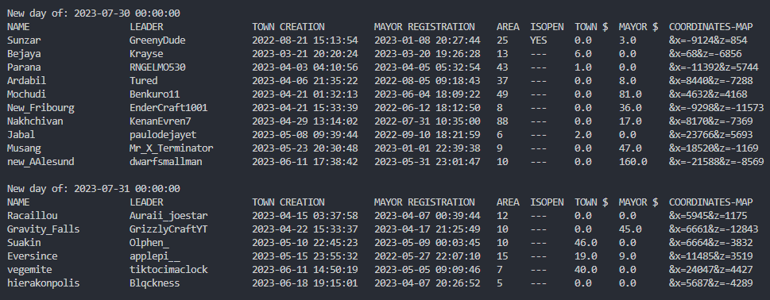

### This repository contains some gaiming projects built on passion. 
#### 1. [EarthMC](https://earthmc.net/) Minecraft server **town raiding tool - TRT**
Raiding towns - aka marodeuring towns, that just has turned into ruins - is one of the most efficent methods of earning any resourses on town-developing dedicated server [EarthMC](https://earthmc.net/). Each day, dozens of players compete in order to get best loots from towns, turning into ruins. In this competition the time and knowledge about cities are the main success factors. 

This tool analyses all the server towns and provides a schedule on what town are gonna fall on the specific newday. It also gives you additional information about towns: 

1. Town & leader names, coordinates *(See the last column in the list below - it can be copied to the server map link.)*; 
2. Mayor and town wealth (in gold); 
3. Mayor registration date, town creation date; 
4. Town size in chunks; 
5. Whether a town is OPEN or not.

|  | 
|:--:| 
| *Newday Example* |

Using this information a town-raider can plan his raid beforehand to achieve more success.

**How to use?**

1. Look through settings.yml and set ```when_the_new_day_is_in_your_time_zone``` and other settings in main section. Other settings are optional and can be changed if needed. 
2. Run the ```town_raiding_tool.exe``` program! *Each program run takes 15-30 minutes (or 10-15 minutes if ```optimize_towns_parsing_if_possible``` is enabled) to complete, because it analyses all of the towns. If a program run takes too long, try reducing ```sleep_time``` option.*
3. In a result you get a list of the towns in console and a file in ```saved_data/``` folder.

WARNING: Avoid changing files and their names in ```saved_data/``` folder.